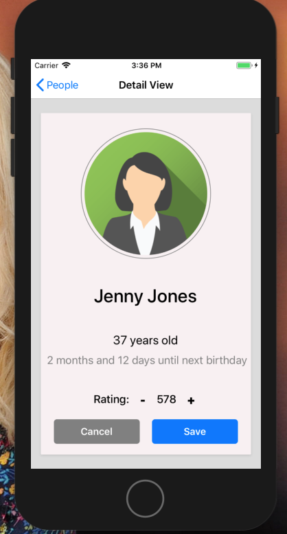

# Circular Wave Full Stack App

## Overview

This is an end-to-end project that uses the key parts of the Circular Wave stack. Built as training before starting the job.

The project is a mobile app using React Native with a node / express server and utilising the Firebase Firestore database and deployed via Heroku.

---

Here is the link to the deployed backend:

#### [CWBackEnd](https://github.com/Petemab/cwBackEnd)
#### [Heroku](https://cwbackend.herokuapp.com/)

 ---

After the initial build I then rebuilt the app using Redux:
#### [CWAppwithRedux](https://github.com/Petemab/cwAppWithRedux/tree/master/cwAppwithReduxV2)

---

### Project Brief

##### Technical Requirements and Necessary Deliverables

* Mobile app shows a scrolling list view of people’s names, retrieved from back end
* Touching a person retrieves extra data from the server about them
* Some date manipulation
* Use of local state to manipulate the person’s record
* + Brownie points: submit back and update DB
* That’s about it!
* It looks simple but there is quite a lot to think about!
* Your end project should be running on a device
* Your choice of iOS or Android
* During development, we recommend using the iOS simulator - it is much quicker and easier than the Android Virtual
Machine
* Ensure you have the latest versions of Xcode
* This project requires the use of a navigator of some sort

* #### List View
* The dataset should be big enough to demonstrate overflow / scrolling (e.g. 10 items)
* NB using flexbox for the items may cause interesting behaviour!
* You should not retrieve the entire dataset when this screen loads, your back end should implement some way of retrieving the list
* #### Detail View
* Touching a list item should make a call to your back end to get the candidate’s full “record” from the database
* You will need to use a React Native navigator to manage transition to the next screen
* We use react-native-navigation
* Suggest you pull into the project very early to get a handle on how it works
* The profile image should not be pulled down in the previous List View as this is inefficient, it should only be retrieved when this screen loads
* Images should be image files, not be URLs
* Images should be clipped to a circle as shown here, with a border
* #### Dates
* How are you going to store the date of birth on the database?
* Some date manipulation required
* Please use vanilla JS, no libraries!
* Hint: you’ll need to handle leap years for the
day calculation
* #### Edit Mode
* Pressing edit enters “Edit Mode”
* Buttons change and additional + and - buttons appear.
* The + and - increment / decrement the pointless rating variable
* Should hold current variable value (being set by +/-) in
component state until either Cancelled or Saved
* If Cancel pressed, reverts to previous value
* NB component will still have original value through props

### Technologies:

For this project I have used the following technologies:

* JavaScript (ECMAScript 6)
* React Native
* Node JS
* express
* Firebase Firestore
* Git
* GitHub
* Heroku

### Screenshots

Some screenshots of the finished app.

Home Page:

Scrolling List View page:

Details Page:

Details Page in edit mode:

### Challenges and Problems

### Wins
